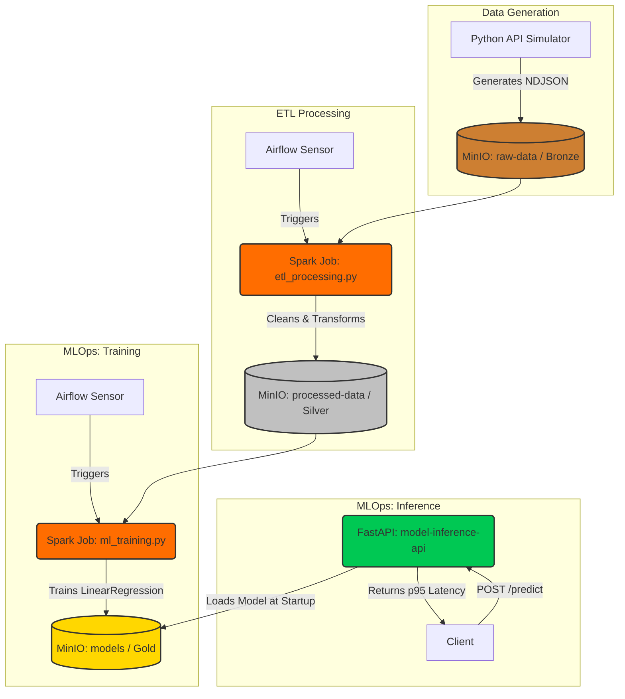

```mermaid
graph TD
    subgraph Data Generation
        A[Python API Simulator] -->|Generates NDJSON| B[(MinIO: raw-data / Bronze)]
    end
    
    subgraph ETL Processing
        C[Airflow Sensor] -->|Triggers| D(Spark Job: etl_processing.py)
        B --> D
        D -->|Cleans & Transforms| E[(MinIO: processed-data / Silver)]
    end
    
    subgraph MLOps: Training
        F[Airflow Sensor] -->|Triggers| G(Spark Job: ml_training.py)
        E --> G
        G -->|Trains LinearRegression| H[(MinIO: models / Gold)]
    end
    
    subgraph MLOps: Inference
        I(FastAPI: model-inference-api) -->|Loads Model at Startup| H
        J[Client] -->|POST /predict| I
        I -->|Returns p95 Latency| J
    end

    style B fill:#CD7F32,stroke:#333,stroke-width:2px
    style E fill:#C0C0C0,stroke:#333,stroke-width:2px
    style H fill:#FFD700,stroke:#333,stroke-width:2px
    style D fill:#ff6d00,stroke:#333,stroke-width:2px
    style G fill:#ff6d00,stroke:#333,stroke-width:2px
    style I fill:#00c853,stroke:#333,stroke-width:2px
```
